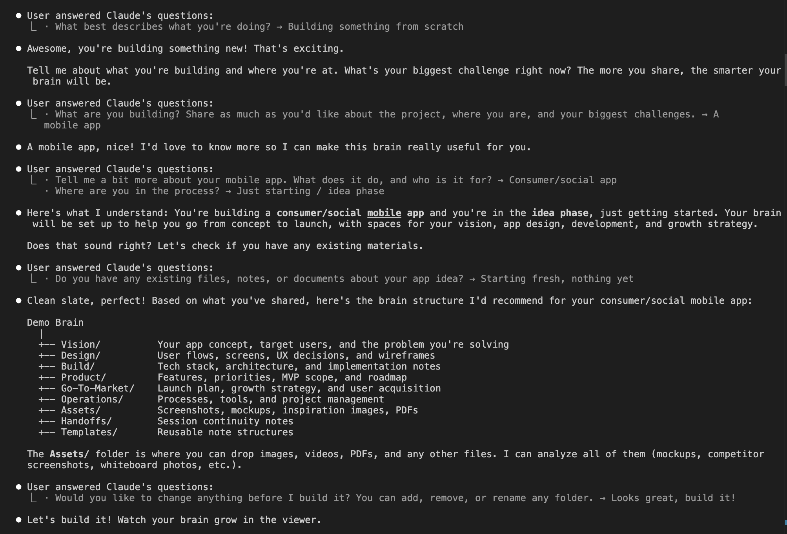

<div align="center">


# BrainTree OS

**Give your AI agent a brain.**

A local-first project management system designed for AI agents. One command creates a structured knowledge base with departments, execution plans, agent personas, and 8 slash commands. Your AI stops guessing and starts executing.

[](https://www.npmjs.com/package/brain-tree-os)
[](https://typescriptlang.org)
[](LICENSE)
[](CONTRIBUTING.md)
[](https://nodejs.org)

[Quick Start](#-quick-start) · [The Problem](#-the-problem) · [How It Works](#-how-it-works) · [Commands](#-commands) · [Workflow](#-the-workflow) · [Contributing](CONTRIBUTING.md)


</div>

---

## The Problem

AI coding assistants are powerful, but they have no memory between sessions. Every time you start a new conversation, you lose context. Your AI doesn't know what was built yesterday, what's blocked, or what to work on next.

**BrainTree OS solves this.** It gives your AI agent an organizational structure (a "brain") that persists across sessions. The brain contains everything: project vision, technical architecture, marketing strategy, execution plan, session handoffs, and agent personas. Your AI reads this brain at the start of every session and knows exactly where things stand.

**The result:** Instead of "what should I work on?", your AI says "Last session you completed the auth system. The API layer is now unblocked. Here are your top 3 priorities."

### What makes it different

- **Not a template generator.** BrainTree creates 25-40 files of real, actionable content tailored to YOUR project.
- **Not a task tracker.** It's a full organizational brain with departments, execution plans, and cross-linked knowledge.
- **Not cloud-dependent.** Everything runs locally. No accounts, no API keys, no data leaving your machine.
- **Not just for code.** Marketing, product strategy, business development, and operations are first-class citizens.

---

## Quick Start

> **Requires [Node.js 20+](https://nodejs.org) and [Claude Code](https://docs.anthropic.com/en/docs/claude-code)**

### 1. Start the brain viewer

```bash
npx brain-tree-os
```

This starts a local web server and opens a brain viewer in your browser. A demo brain is included so you can explore immediately.


### 2. Create your brain

Open Claude Code in any project directory and run:

```
/init-braintree
```

An interactive wizard asks about your project and generates a complete brain structure: departments, execution plan, agent personas, templates, and more.



### 3. Start working

```
/resume-braintree
```

Claude reads your brain, shows you what was done last session, what's in progress, and recommends what to tackle next. When you're done:

```
/wrap-up-braintree
```

This updates your brain files, creates a handoff document, and logs your progress. Next session picks up exactly where you left off.

---

## How It Works

```
  You run: npx brain-tree-os
              |
              v
  +----------------------------+
  |  CLI                       |
  |  1. Installs 8 commands    |
  |     to ~/.claude/commands/ |
  |  2. Starts Next.js server  |
  |  3. Opens browser          |
  +----------------------------+
              |
              v
  +----------------------------+     +--------------------+
  |  Brain Viewer (localhost)  |<--->|  Your Project      |
  |   - Graph visualization    |     |    .braintree/     |
  |   - File tree browser      |     |    BRAIN-INDEX.md  |
  |   - Markdown viewer        |     |    CLAUDE.md       |
  |   - Execution plan pane    |     |    00_Company/     |
  |   - Session timeline       |     |    01_RnD/         |
  +----------------------------+     |    02_Product/     |
              |                      |    Execution-Plan/ |
         WebSocket                   |    Handoffs/       |
              |                      +--------------------+
              +--- live updates via chokidar ---+
```

When you create or edit files through Claude Code, they appear in the browser instantly. The viewer watches your filesystem and updates the graph, file tree, and content in real time.

---

## What's Inside a Brain

Every brain is a directory on your filesystem with this structure:

```
my-project/
├── .braintree/
│   └── brain.json              # Brain metadata (id, name, description)
├── BRAIN-INDEX.md              # Central hub linking to everything
├── CLAUDE.md                   # AI agent instructions ("brain DNA")
├── Execution-Plan.md           # Build roadmap with phases and steps
│
├── 00_Company/                 # Identity, vision, mission, values
│   ├── Company.md              # Folder index
│   ├── Mission.md
│   └── Values.md
├── 01_RnD/                     # Engineering, architecture, tech stack
│   ├── RnD.md
│   ├── Architecture.md
│   └── Tech-Stack.md
├── 02_Product/                 # MVP scope, roadmap, features
│   ├── Product.md
│   ├── MVP-Scope.md
│   └── Feature-Priorities.md
├── 03_Marketing/               # Go-to-market, content, SEO
│   └── ...
│
├── Handoffs/                   # Session continuity documents
│   ├── Handoffs.md
│   ├── handoff-001.md
│   └── handoff-002.md
├── Templates/                  # Reusable note templates
├── Assets/                     # Images, PDFs, reference files
└── .claude/agents/             # AI agent persona files
    ├── builder.md
    ├── strategist.md
    └── researcher.md
```

### Key concepts

**BRAIN-INDEX.md** is the central hub. It links to every top-level folder and file. When your AI agent reads this first, it instantly understands the full project structure.

**CLAUDE.md** contains the brain's "DNA": conventions, rules, and instructions that every AI agent follows. Think of it as the team handbook.

**Wikilinks** (`[[like this]]`) connect files into a knowledge graph. The viewer renders these as interactive nodes and edges. Every file links back to its parent via `> Part of [[ParentIndex]]`, creating a clean hierarchy with no orphan nodes.

**Execution Plan** is a structured build roadmap with phases, steps, and task checklists. Each step has a status (`not_started`, `in_progress`, `completed`, `blocked`) and dependencies on other steps.

**Handoffs** are session continuity documents. Each one captures what was done, decisions made, blockers found, and what to do next. This is what makes `/resume-braintree` so powerful.

**Agent Personas** (in `.claude/agents/`) define specialized AI roles for your project. A builder focuses on code, a strategist on product decisions, a researcher on market analysis. Each has their own instructions and capabilities.

---

## Commands

BrainTree installs 8 slash commands into Claude Code. These are the core of the workflow.

### `/init-braintree`

**Create a new brain from scratch.**

A multi-phase interactive wizard that:
1. Asks about your project (what you're building, who it's for, what you have so far)
2. Generates a custom brain structure tailored to your specific goals
3. Creates 25-40+ files with real, actionable content (not empty templates)
4. Sets up agent personas matched to your needs
5. Builds an execution plan with phases and dependencies

The brain appears in the viewer in real time as files are created.


### `/resume-braintree`

**Resume work from where you left off.**

The most important command. Every session starts here. It:
1. Reads your full brain context (BRAIN-INDEX, CLAUDE.md, latest handoff, execution plan)
2. Shows what was accomplished last session
3. Displays progress bars for each phase
4. Lists the top unblocked steps ranked by priority
5. Identifies parallel execution opportunities
6. Asks what you want to work on

Transforms a vague "what should I do?" into a clear action plan.


### `/wrap-up-braintree`

**End your session with full continuity.**

Creates a bridge to your next session by:
1. Auditing everything done in the current session
2. Updating all affected brain files (departments, indexes, execution plan)
3. Marking execution plan steps as completed/in-progress/blocked
4. Creating a detailed handoff document with:
   - Session summary
   - Files created/modified
   - Decisions made and their rationale
   - Open blockers
   - Recommended next steps
5. Updating brain indexes to prevent orphan nodes

**This is what makes session continuity work.** Without it, your next `/resume-braintree` wouldn't know what happened.

### `/status-braintree`

**Full project health dashboard.**

Shows:
- Execution plan progress bars for each phase
- Steps in progress, blocked, and ready to start
- File counts and health per department
- Knowledge graph stats (total files, wikilinks, orphans)
- Session timeline from recent handoffs
- Recommendations for what to fix or tackle next

### `/plan-braintree [step]`

**Break a high-level step into concrete tasks.**

Takes an execution plan step and creates a detailed implementation plan:
- Numbered tasks with effort estimates (S/M/L)
- Task dependencies and parallel opportunities
- Specific files to create or modify
- Acceptance criteria
- Saves the plan to your brain for reference

### `/sprint-braintree`

**Plan a week of work.**

Agile-style sprint planning:
- Analyzes unblocked and in-progress steps
- Groups work into parallel blocks by theme
- Creates a day-by-day plan with effort estimates
- Identifies dependencies and buffer time

### `/sync-braintree`

**Brain health check and auto-repair.**

Audits your brain for:
- Orphan files (not connected to the graph)
- Broken wikilinks (pointing to files that don't exist)
- Empty folders with no content
- Stale content (TODO markers, outdated info)
- Execution plan drift

Fixes most issues automatically and asks about ambiguous cases.

### `/feature-braintree [name]`

**Plan and implement a new feature.**

End-to-end feature management:
1. Creates a feature spec with user stories, requirements, and technical approach
2. Links it to the execution plan
3. Breaks it into implementation tasks
4. Guides you through each task
5. Updates the brain as you go

---

## The Workflow

### Session 0: Create your brain

```
$ npx brain-tree-os          # Start the viewer
$ claude                      # Open Claude Code
> /init-braintree             # Create your brain
```

The wizard asks questions and builds your brain in real time. Watch it appear in the browser as files are created.

### Session 1+: The daily loop

```
> /resume-braintree           # Load context, see progress, pick a task
> ... work on your project ...
> /wrap-up-braintree          # Save progress, create handoff
```

Every resume reads the last handoff. Every wrap-up creates the next one. Context is never lost.

### The power of continuity

Here's what a typical `/resume-braintree` output looks like after 10 sessions:

```
Session 10 | March 22, 2026

Last session: Built the authentication system (Google + GitHub OAuth),
deployed to Vercel, fixed DNS routing. See handoff-009.

Progress:
  Phase 1: Foundation    [==========] 100%  (7/7)
  Phase 2: Core Build    [======----]  60%  (6/10)
  Phase 3: Polish        [----------]   0%  (0/5)

In Progress:
  - Step 2.4: API routes (started yesterday, 3/7 tasks done)

Ready to Start:
  - Step 2.5: Real-time updates (unblocked by Step 2.4)
  - Step 2.7: Mobile responsiveness (no dependencies)

What would you like to work on?
```

Your AI agent has full context. It knows the architecture decisions from Session 3, the bug fix from Session 7, and the blocker identified in Session 9. No re-explaining needed.

---

## The Brain Viewer

The web viewer at `localhost:3000` shows your brain visually:

### Graph View + File Tree + Execution Plan


Three-pane layout: file tree on the left, interactive D3.js graph in the center (nodes color-coded by department, click to open), and execution plan on the right showing phases, steps, and progress.

### Real-time Updates

Files created or edited in Claude Code appear in the browser within seconds. The graph grows, the file tree updates, and content refreshes automatically via WebSocket.

---

## Demo Brain

BrainTree ships with a demo brain based on **clsh.dev**, a real project built from zero to launch in 6 days across 38 sessions. It demonstrates:

- Full brain structure with 43 interconnected files
- Complete execution plan with phases and completed steps
- Session handoffs showing how the project evolved
- Department organization (Company, RnD, Product, Marketing, etc.)

Explore it at `http://localhost:3000/brains/demo` after running `npx brain-tree-os`.

---

## Architecture

| Layer | Technology |
|-------|------------|
| Frontend | Next.js 15, React 19, Tailwind CSS v4, shadcn/ui |
| Graph | D3.js force simulation |
| Real-time | WebSocket (ws) + chokidar filesystem watcher |
| CLI | Node.js, TypeScript |
| Monorepo | Turborepo, npm workspaces |

### Data flow

1. CLI starts Next.js server with custom HTTP + WebSocket handler
2. Browser connects to WebSocket at `/ws`
3. User selects a brain; server starts watching that brain's directory with chokidar
4. When files change on disk, server sends `file-changed` events
5. Browser re-fetches data and updates graph/tree/viewer

### Local data layer

All data comes from the filesystem. No database.
- **Brain registry**: `~/.braintree-os/brains.json` tracks all registered brains
- **File scanning**: Recursively finds all `.md` files in a brain directory
- **Wikilink parsing**: Extracts `[[links]]` from file content to build the graph
- **Execution plan parsing**: Structured extraction of phases, steps, and tasks from markdown

---

## Cloud Version

Want hosted brains, team collaboration, and a managed MCP server? Check out [brain-tree.ai](https://brain-tree.ai), the cloud version of BrainTree with:

- Brain generation wizard in the browser
- Shared brains with team members
- MCP server for remote AI agent access
- OAuth authentication (Google, GitHub)
- Subscription management

BrainTree OS and brain-tree.ai use the same brain format. You can start locally and move to the cloud, or use both.

---

## FAQ

**Do I need Claude Code?**
The brain viewer works without it, but the 8 slash commands are designed for Claude Code. They're what make the AI-assisted workflow possible.

**Can I use this with other AI tools?**
The brain itself is just markdown files and folders. Any AI tool that can read and write files can work with a brain. The slash commands are Claude Code specific, but the brain format is universal.

**Where does my data go?**
Nowhere. Everything stays on your local filesystem. BrainTree OS makes zero network requests. No telemetry, no analytics, no cloud sync.

**Can I use my own folder structure?**
Yes. The init wizard generates a suggested structure, but you can reorganize freely. As long as you maintain wikilinks and the BRAIN-INDEX hub, the graph will work.

**How is this different from Obsidian?**
Obsidian is a general-purpose note-taking app. BrainTree is purpose-built for AI-assisted project execution. The brain structure, slash commands, execution plan tracking, session handoffs, and agent personas are all designed for a specific workflow: AI and human building a product together.

---

## Contributing

We welcome contributions! See [CONTRIBUTING.md](CONTRIBUTING.md) for development setup and guidelines.

## Security

Found a vulnerability? See [SECURITY.md](SECURITY.md) for our disclosure policy.

## License

MIT. See [LICENSE](LICENSE) for details.

---

<div align="center">

**Your project brain should be yours. No cloud required.**

[brain-tree.ai](https://brain-tree.ai) · [npm](https://www.npmjs.com/package/brain-tree-os) · [Discord](https://discord.gg/9DAUd2UuEV)

</div>
